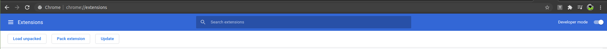

# Youtube speed adjust

This is a Google Chrome Extension that can speed up or slow down a Youtube video. The default available options are 0.25x, 0.5x, 0.75x, 1x, 1.25x, 1.5x, 1.75x and 2x. I typically find 2x is sometimes too slow, and feels more natural to listen at 3x or 4x speeds, so I made this extension. You get every 0.25 speed increments to infinity.

## How to use it?


After you have installed it, go to a youtube video, open the extension and click to speed up or slow down. That's it.

## How to install it?

Clone this repo into a folder. Go to `chrome://extensions` and enable developer mode:



Then click `Load unpacked`, navigate to the repo and accept.

## How does it work internally?

The inner workings is quite simple. It just runs this command:

```js
document.getElementsByTagName("video")[0].playbackRate = 2
```

You can replace "2" with any other speed you want.
